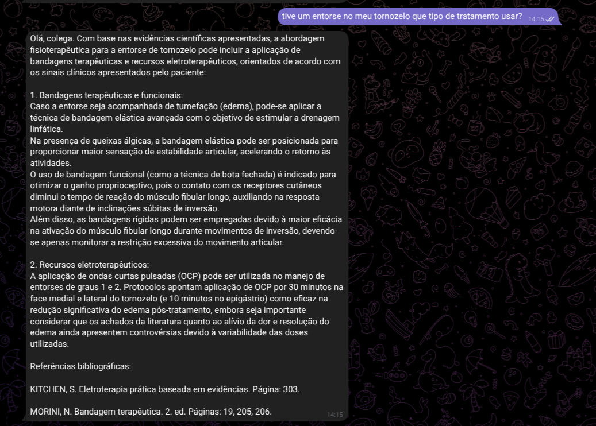

# Brian - Fisio RAG

A Retrieval-Augmented Generation (RAG) system designed to assist physiotherapists by providing instant, accurate answers retrieved directly from authoritative physiotherapy, anatomy, and medical textbooks through an interactive Telegram bot.

Optimized for the Portuguese language, the system runs locally on modest hardware (leveraging an **NVIDIA GeForce MX130 GPU** with the `multilingual-e5-small` embedding model loaded in VRAM).

---

## System Architecture & Tech Stack

* **Interface:** Telegram Bot API for seamless, mobile-friendly interaction.
* **Embeddings & Retrieval:** `multilingual-e5-small` model optimized for Portuguese text retrieval, running locally with VRAM management tailored for an MX130 GPU.
* **Vector Database:** **FAISS (Facebook AI Similarity Search)** for high-efficiency similarity search and fast retrieval of relevant context chunks.
* **LLM Integration:** Generates answers strictly using retrieved context from indexed sources, ensuring factual accuracy and proper source citations.

### Core Module: `pdf_handler.py`
The backbone of the document ingestion pipeline is implemented in `pdf_handler.py`, which handles:
1. **Book Discovery:** Automatically scans and detects PDF files in the designated repository.
2. **Text Extraction & Scan Validation:** Extracts raw text and checks whether documents are scanned images requiring OCR handling.
3. **Smart Chunking:** Splits large pages into smaller, semantically controlled chunks to fit embedding model context limits.
4. **Embedding Generation:** Computes vector representations using the local model.
5. **Index Persistence:** Saves the FAISS index alongside corresponding metadata for lightning-fast retrieval during inference.

---

## Indexed Reference Library

The system indexes a comprehensive collection of standard textbooks across anatomy, biomechanics, physiology, and specialized physical therapy:

* **Anatomy & Histology:**
  * *Anatomia Orientada para a Clínica* – 7ª Edição (Moore)
  * *Anatomia na Prática: Sistema Musculoesquelético* – 1ª Edição (Pozzobon, Pereira, Jung)
  * *Anatomia para Colorir* (Netter)
  * *Netter - Atlas de Anatomia Humana* – 6ª Edição
  * *Sobotta - Cabeça, Pescoço e Extremidades Superiores* – Volume 1
  * *Histologia Básica* – 12ª Edição (Junqueira & Carneiro)
* **Biomechanics & Kinesiology:**
  * *Cinesiologia e Biomecânica*
  * *Diagnóstico Cinetico-Funcional e Imaginologia*
  * *Kapandji* – Volumes 1, 2, and 3
* **Physiology & Clinical Practice:**
  * *Fisiologia Médica* (Guyton)
  * *Fisiologia Respiratória* (West)
  * *Exame Neurológico: Bases Anatomofuncionais* (Gusmão)
  * *Bases da Fisioterapia Respiratória: Terapia Intensiva e Reabilitação* – 1ª Edição (Machado)
  * *ABC da Ventilação Mecânica* – Volumes 1 & 2 (360940236-ABC-da-Ventilac-a-o-Meca-nica)
  * *Princípios e Práticas de Ventilação Mecânica em Pediatria e Neonatologia*
  * *Agentes Físicos Terapêuticos* (Dr. Jorge Enrique Martin Cordero)
  * *Bandagem Terapêutica* – 2ª Edição (Neuson Morini)
  * *Eletroterapia em Estética Corporal* (Marizilda Toledo)
  * *Eletroterapia Prática Baseada em Evidências* (Sheila Kitchen)
  * *Urofisioterapia*
  * *Política Nacional de Práticas Integrativas e Complementares no SUS*
  * *Questões: Residências em Fisioterapia*

---

## Legal Disclaimer

> **I DO NOT HAVE THE RIGHTS FOR THESE BOOKS.** 
> This project is built strictly for educational, research, and personal portfolio purposes. No copyright infringement is intended, and the source texts are not distributed publicly through this repository.
